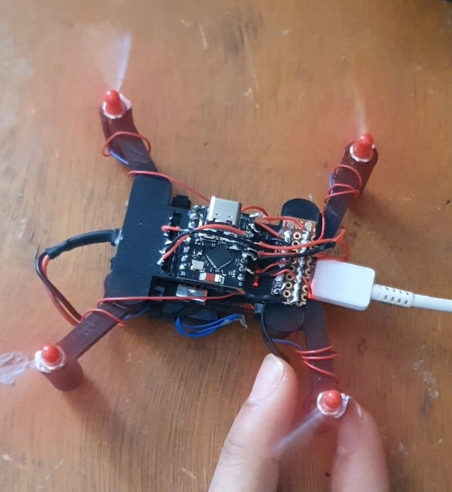
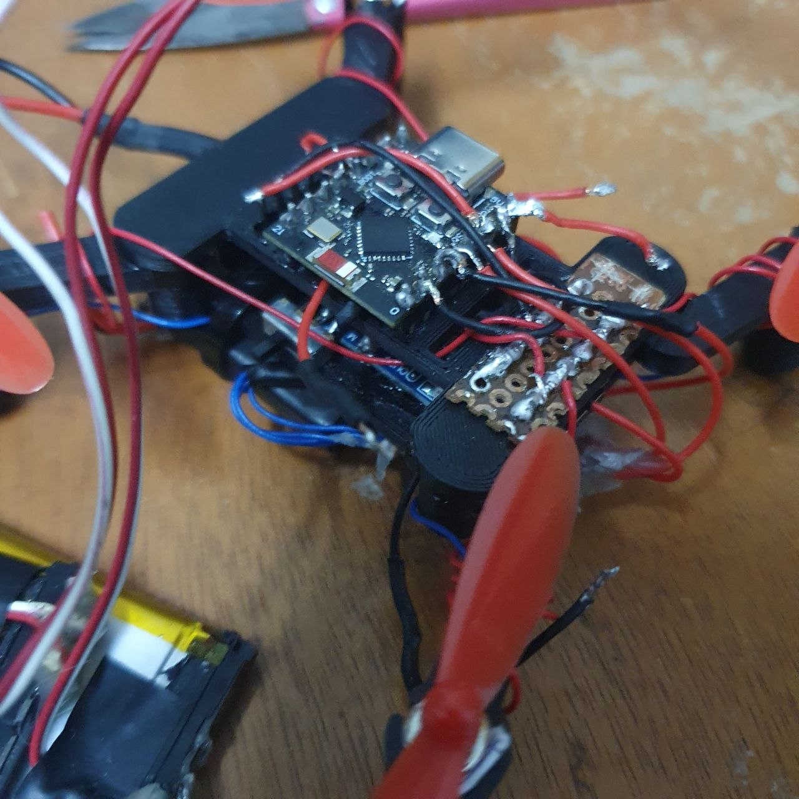
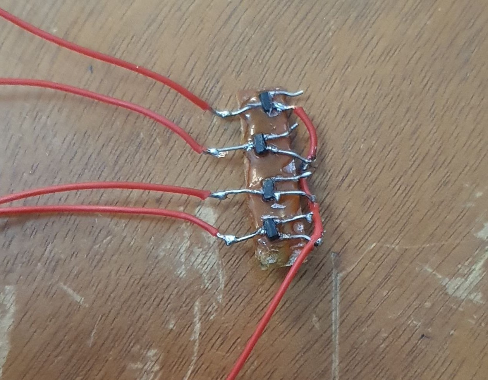
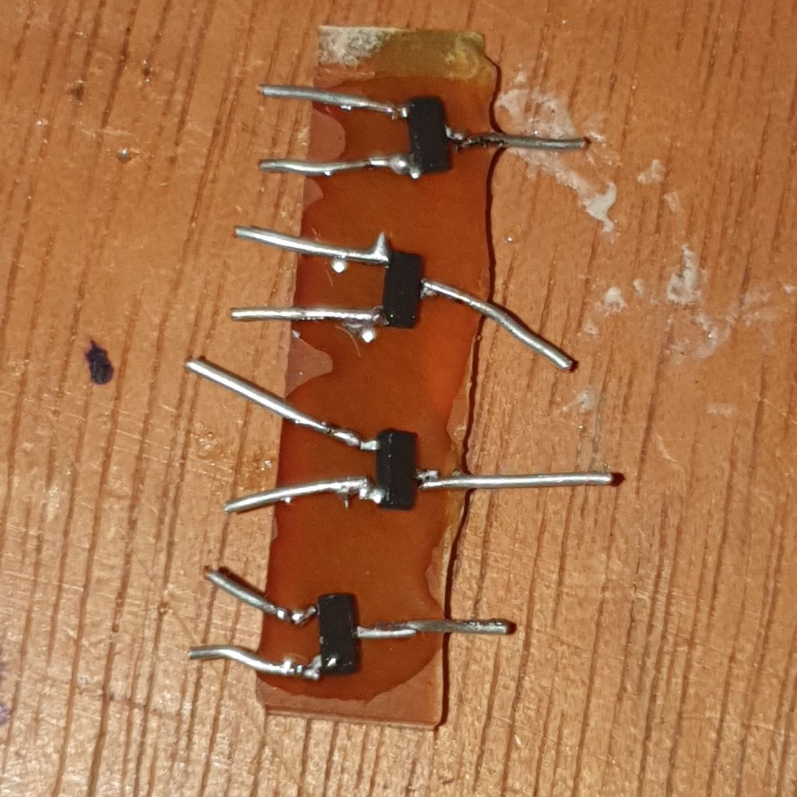
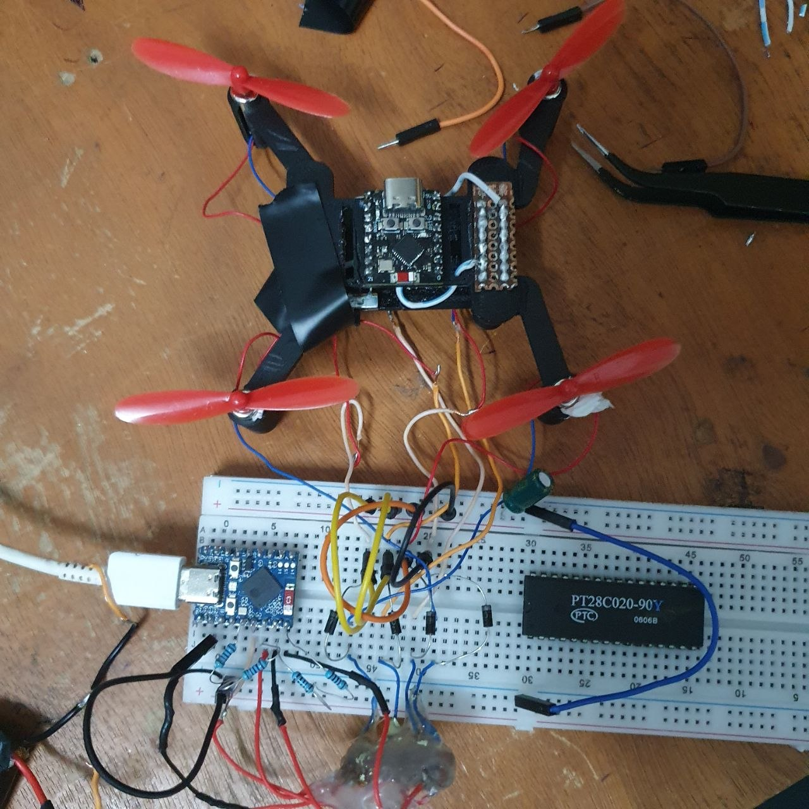
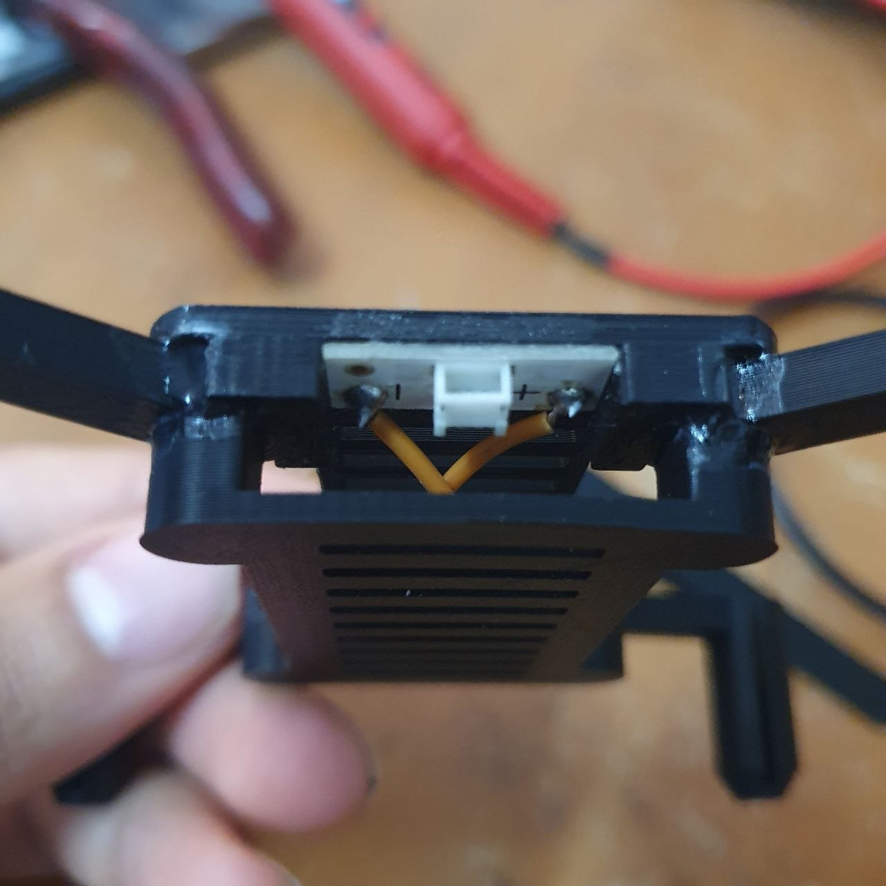
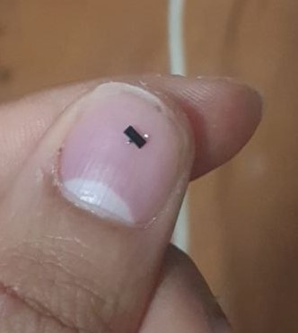

# ESP32-Powered Ultra-Mini Drone (Project V1)

A compact, high-performance drone development project utilizing the ESP32 platform to drive brushed coreless motors via a custom MOSFET-based power stage.

## 📋 Project Overview
This project focuses on the development of a lightweight flight controller and motor driver system. The current "V1" phase validates the hardware architecture, including PWM signal generation, power distribution, and inductive load protection.

## 🛠 Hardware Specifications

* **Controller:** ESP32-C3 Super Mini (Production) and ESP32-S3 Zero (Testing).
* **Motor Driver:** Custom-built 4-channel MOSFET array.
    * **MOSFET Model:** Si2302 (Marked **A6SHB**).
    * **Logic Level:** 3.3V gate-compatible for direct ESP32 integration.
* **Motors:** High-speed brushed coreless motors.

## ⚡ Circuit Protection & Reliability

To ensure stability during high-current operations and prevent hardware failure, the following protections are implemented:

* **Flyback Diodes:** Installed across each motor to suppress inductive voltage spikes during high-speed PWM switching.
* **Pull-down Resistors:** Integrated into the MOSFET gates to prevent floating states and unintended motor activation during the ESP32 boot sequence.

## 📂 Repository Structure
* `FIRMWARE/`: Firmware source code, including PWM motor test logic.
* `include/`: Header files for hardware definitions.
* `HARDWARE/`: COMPONENTS AND DATASHEETS 
* `ASSETS/`: IMAGES AND EXTRA STUFF.
  
## 🚀 Development Status: Phase 1 (Functional Validation)

Current testing has confirmed:
* **Individually Controllable Motors:** Each motor can be driven through the full 0–255 PWM range.
* **Signal Integrity:** The pull-down resistors successfully stabilize the MOSFET gates.

* **Power Handling:** The Si2302 MOSFETs manage the current draw, though high consumption is observed under propeller load.

### Known Issues & Troubleshooting

* **Current Draw:** Significant increase in current consumption with propellers attached; investigating battery C-rating requirements.

## ⚠️ Safety Disclaimer
**Propellers must be removed during bench testing.** Due to the high RPM of coreless motors and the potential for software-induced "lock-up," bench testing without propellers is mandatory to prevent injury or hardware damage.

---
**Developers:** 0xNaviMetal , AYOUB  
**Version:** 1.0.0 (Alpha)# ESP32-Mini-Drone---Project-V1-Development-
